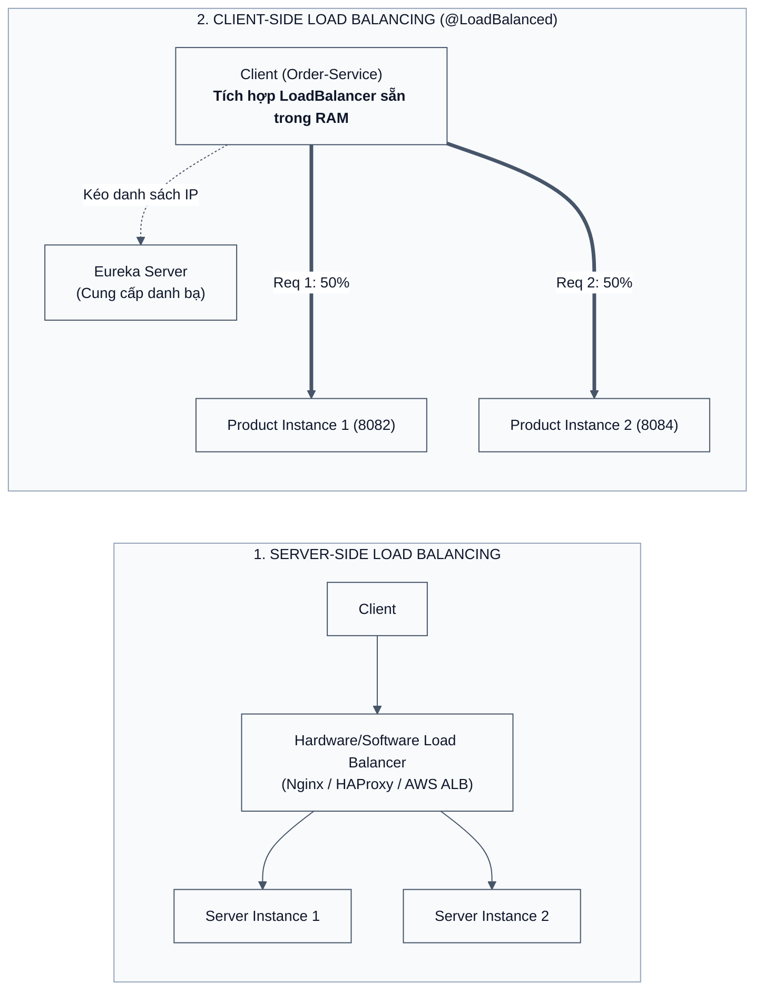
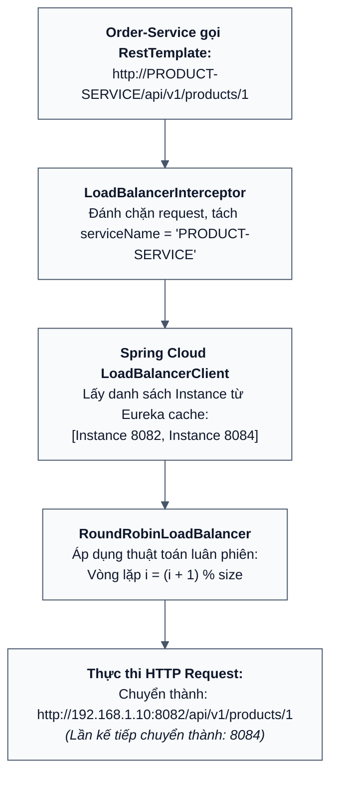

# [BÀI TẬP 4 - GIỎI] CÂN BẰNG TẢI PHÍA CLIENT VỚI @LOADBALANCED

## CƠ CHẾ CLIENT-SIDE LOAD BALANCING VỚI SPRING CLOUD LOADBALANCER, CHẠY ĐA INSTANCE PRODUCT-SERVICE & PHÂN PHỐI TẢI ROUND-ROBIN

> **Đề bài:** Để hệ thống có tính sẵn sàng cao (High Availability) và chịu tải tốt hơn, khởi chạy 2 instance của `Product-Service` trên 2 cổng khác nhau (8082 và 8084). Cấu hình Bean `RestTemplate` với chú thích `@LoadBalanced` trong `Order-Service`. Thực hiện gọi API thông qua URL định danh logic `http://PRODUCT-SERVICE/api/v1/products/`. Gọi API tạo đơn hàng nhiều lần và kiểm chứng qua log của 2 instance cho thấy yêu cầu được phân phối đều.
> **Bài làm của em:** Phân tích nguyên lý Client-Side Load Balancing, cơ chế hoạt động ngầm của `@LoadBalanced`, hướng dẫn từng bước cấu hình chạy đa bản sao (Multi-instance) trên IntelliJ IDEA và CLI, triển khai mã nguồn và tiến hành thí nghiệm thực chứng phân phối tải luân phiên (Round-Robin 50/50).

---

## MỤC LỤC

1. [Tổng quan về Cân bằng Tải (Load Balancing) trong Microservices](#1-tổng-quan-về-cân-bằng-tải-load-balancing-trong-microservices)
   - 1.1. Server-Side Load Balancing vs. Client-Side Load Balancing
   - 1.2. Tại sao Client-Side Load Balancing lại được ưu chuộng trong kiến trúc nội bộ?
2. [Cơ chế Hoạt động của Chú thích `@LoadBalanced`](#2-cơ-chế-hoạt-động-của-chú-thích-loadbalanced)
   - 2.1. Đằng sau hậu trường: `LoadBalancerInterceptor` & `LoadBalancerClient`
   - 2.2. Giải thuật phân phối tải Round-Robin
   - 2.3. Quá trình biến đổi từ URL trừu tượng sang URL vật lý
3. [Cấu trúc Thư mục Hệ thống Microservices trong Bài 4](#3-cấu-trúc-thư-mục-hệ-thống-microservices-trong-bài-4)
4. [Hướng dẫn Cấu hình Chạy Song Song 2 Instance của Product-Service](#4-hướng-dẫn-cấu-hình-chạy-song-song-2-instance-của-product-service)
   - 4.1. Cấu hình `application.properties` hỗ trợ phân biệt Instance ID
   - 4.2. Khởi chạy Instance 1 trên cổng `8082`
   - 4.3. Cấu hình IntelliJ IDEA cho phép "Allow multiple instances"
   - 4.4. Khởi chạy Instance 2 trên cổng `8084` bằng Program Arguments
   - 4.5. Khởi chạy song song bằng Terminal CLI
5. [Triển khai Mã Nguồn trong `Order-Service`](#5-triển-khai-mã-nguồn-trong-order-service)
   - 5.1. Khai báo Bean `RestTemplate` đính kèm `@LoadBalanced`
   - 5.2. Viết Controller gọi qua URL định danh `http://PRODUCT-SERVICE/`
   - 5.3. Xây dựng API kiểm chứng phân phối tải tự động
6. [Thực nghiệm & Kiểm chứng Kết quả Phân phối Tải](#6-thực-nghiệm--kiểm-chứng-kết-quả-phân-phối-tải)
   - 6.1. Xác nhận 2 instance trên Eureka Dashboard
   - 6.2. Kịch bản gửi 10 requests liên tiếp
   - 6.3. Đối chiếu log Console tại Instance 8082 và Instance 8084
7. [Kết luận của em](#7-kết-luận-của-em)

---

## 1. Tổng quan về Cân bằng Tải (Load Balancing) trong Microservices

### 1.1. Server-Side Load Balancing vs. Client-Side Load Balancing

Trong kiến trúc phần mềm, cân bằng tải là kỹ thuật chia sẻ khối lượng công việc giữa nhiều máy chủ nhằm tối ưu hóa việc sử dụng tài nguyên, tối đa hóa thông lượng và tránh tình trạng một node bị quá tải.



| Tiêu chí so sánh                 | Server-Side Load Balancing                               | Client-Side Load Balancing (`@LoadBalanced`)                      |
| :------------------------------- | :------------------------------------------------------- | :---------------------------------------------------------------- |
| **Vị trí quyết định định tuyến** | Tại thiết bị trung gian (Proxy/Reverse Proxy).           | Ngay tại bộ nhớ RAM của chính dịch vụ gọi (Client).               |
| **Thành phần hạ tầng**           | Cần thêm cụm Nginx, F5, HAProxy hoặc AWS ALB.            | Không cần phần cứng/phần mềm trung gian, nhẹ và tích hợp sẵn.     |
| **Độ trễ mạng (Latency)**        | Tốn thêm 1 chặng mạng (hop) trung gian qua LB.           | Kết nối thẳng Point-to-Point, độ trễ cực thấp.                    |
| **Điểm lỗi đơn lẻ (SPOF)**       | Nếu thiết bị LB chết, toàn bộ hệ thống tê liệt.          | Không có SPOF, mỗi client tự chịu trách nhiệm cân bằng.           |
| **Phù hợp nhất cho**             | Lưu lượng ngoài Internet đi vào hệ thống (Edge/Ingress). | Giao tiếp nội bộ giữa các Service (Service-to-Service East-West). |

### 1.2. Tại sao Client-Side Load Balancing lại được ưu chuộng trong kiến trúc nội bộ?

Khi hệ thống có hàng trăm microservices gọi chéo lẫn nhau (East-West traffic), nếu mỗi lời gọi đều phải đi qua một con Nginx trung gian thì con Nginx đó sẽ phải chịu tải khổng lồ và trở thành nút thắt cổ chai lớn nhất. Với Client-Side Load Balancing, mỗi microservice tự biết danh sách các instance của dịch vụ khác (thông qua Eureka) và tự luân chuyển request, giúp tải trọng được phân tán hoàn toàn tự nhiên.

---

## 2. Cơ chế Hoạt động của Chú thích `@LoadBalanced`

### 2.1. Đằng sau hậu trường: `LoadBalancerInterceptor` & `LoadBalancerClient`

Khi gắn chú thích `@LoadBalanced` lên một `@Bean RestTemplate`, Spring Cloud sẽ tự động can thiệp vào vòng đời của `RestTemplate` bằng một bộ chặn (ClientHttpRequestInterceptor):



1. **Đánh chặn yêu cầu:** Bộ chặn `LoadBalancerInterceptor` trích xuất phần Hostname trong URL (ví dụ `PRODUCT-SERVICE`).
2. **Tra cứu danh bạ:** `LoadBalancerClient` kiểm tra trong bộ đệm cục bộ (Local Cache) được đồng bộ từ Eureka để lấy danh sách các `ServiceInstance` đang `UP`.
3. **Lựa chọn instance:** Sử dụng thuật toán cân bằng tải được cấu hình (mặc định là Round-Robin).
4. **Viết lại URL (URL Rewriting):** Thay thế chuỗi trừu tượng `http://PRODUCT-SERVICE` bằng địa chỉ IP và Port thực tế (ví dụ `http://192.168.1.10:8082`), sau đó chuyển tiếp cho thư viện HTTP ngầm thực hiện kết nối.

### 2.2. Giải thuật phân phối tải Round-Robin

Giải thuật Round-Robin là giải thuật xoay vòng đơn giản nhưng cực kỳ hiệu quả và công bằng:
$$\text{Index} = (\text{CurrentIndex} + 1) \pmod{\text{TotalInstances}}$$

Với 2 instance:

- Request 1: Gửi tới Instance 1 (Port 8082).
- Request 2: Gửi tới Instance 2 (Port 8084).
- Request 3: Gửi tới Instance 1 (Port 8082).
- Request 4: Gửi tới Instance 2 (Port 8084).
  Tỷ lệ phân phối lý tưởng luôn đạt mức **50% - 50%**.

---

## 3. Cấu trúc Thư mục Hệ thống Microservices trong Bài 4

```
Session02/bai_4/
├── discovery-server/      # Port 8761 - Eureka Server
├── customer-service/      # Port 8081 - Eureka Client
├── product-service/       # Port 8082 (Instance 1) & Port 8084 (Instance 2)
│   ├── build.gradle
│   ├── settings.gradle
│   └── src/main/
│       ├── java/com/rikkei/productservice/
│       │   ├── ProductServiceApplication.java
│       │   ├── controller/ProductController.java   <-- Ghi log port chi tiết
│       │   └── model/Product.java                  <-- Bổ sung trường serverPort
│       └── resources/application.properties        <-- Instance ID phân biệt
├── order-service/         # Port 8083 - Tích hợp @LoadBalanced RestTemplate
│   ├── build.gradle                                <-- Thêm spring-cloud-starter-loadbalancer
│   ├── settings.gradle
│   └── src/main/
│       ├── java/com/rikkei/orderservice/
│       │   ├── OrderServiceApplication.java        <-- Khai báo Bean @LoadBalanced
│       │   ├── controller/OrderController.java     <-- Gọi http://PRODUCT-SERVICE/
│       │   ├── dto/OrderRequestDTO.java
│       │   ├── dto/ProductResponseDTO.java
│       │   └── model/Order.java
│       └── resources/application.properties
├── bai4.md
└── bai4.pdf
```

---

## 4. Hướng dẫn Cấu hình Chạy Song Song 2 Instance của Product-Service

### 4.1. Cấu hình `application.properties` hỗ trợ phân biệt Instance ID

Trong Eureka, nếu 2 instance của cùng một dịch vụ chạy trên cùng một máy (cùng IP) mà không cấu hình `instance-id`, instance thứ 2 khởi động sẽ ghi đè (overwrite) bản ghi của instance thứ 1 trên Eureka Server.

Vì vậy, cấu hình file `product-service/src/main/resources/application.properties` như sau:

```properties
spring.application.name=PRODUCT-SERVICE
server.port=8082

# CỰC KỲ QUAN TRỌNG: Phân biệt Instance ID bằng cổng port
eureka.instance.instance-id=${spring.application.name}:${server.port}
eureka.instance.prefer-ip-address=true

eureka.client.service-url.defaultZone=http://localhost:8761/eureka/
eureka.instance.lease-renewal-interval-in-seconds=10
eureka.instance.lease-expiration-duration-in-seconds=20
```

> **Giải thích:** Nhờ có `${server.port}` trong `instance-id`, Eureka Server sẽ nhận diện được 2 instance riêng biệt:
>
> - `PRODUCT-SERVICE:8082`
> - `PRODUCT-SERVICE:8084`
>   Cả 2 sẽ cùng xuất hiện song song dưới nhóm `PRODUCT-SERVICE`.

### 4.2. Khởi chạy Instance 1 trên cổng `8082`

- Trong file `application.properties`, giữ nguyên giá trị `server.port=8082`.
- Khởi chạy ứng dụng `ProductServiceApplication` bình thường trên IntelliJ IDEA hoặc Terminal.
- Instance 1 đã chạy và lắng nghe tại port 8082.

### 4.3. Cấu hình IntelliJ IDEA cho phép "Allow multiple instances"

Để IntelliJ cho phép bật cùng lúc 2 tiến trình của cùng một dự án:

1. Ở góc trên bên phải giao diện IntelliJ (cạnh nút Run màu xanh), nhấp vào tên ứng dụng **ProductServiceApplication** $\rightarrow$ Chọn **Edit Configurations...**.
2. Tại cửa sổ cấu hình, tìm nút **Modify options** (hoặc _Build and run options_).
3. Tích chọn mục **Allow multiple instances** (Cho phép chạy nhiều phiên bản đồng thời).

### 4.4. Khởi chạy Instance 2 trên cổng `8084` bằng Program Arguments

1. Vẫn tại bảng **Edit Configurations**, tìm ô **Program arguments** (hoặc _VM Options_).
2. Điền vào ô Program arguments:
   ```
   --server.port=8084
   ```
   _(Hoặc tại ô VM options điền: `-Dserver.port=8084`)_
3. Nhấp **Apply** $\rightarrow$ **OK**.
4. Bấm nút **Run** một lần nữa.
   $\Longrightarrow$ Lúc này IntelliJ sẽ chạy tiến trình thứ 2 song song với tiến trình thứ nhất mà không làm tắt tiến trình trước!

### 4.5. Khởi chạy song song bằng Terminal CLI

Nếu chạy qua dòng lệnh Terminal, thực hiện đơn giản như sau:

```bash
# Cửa sổ Terminal 1 (Chạy Instance 1 - Port 8082):
cd /home/kaisento/Documents/CODE_RIKKEI/Session02/bai_4/product-service
gradle bootRun

# Cửa sổ Terminal 2 (Chạy Instance 2 - Port 8084):
cd /home/kaisento/Documents/CODE_RIKKEI/Session02/bai_4/product-service
gradle bootRun --args='--server.port=8084'
```

---

## 5. Triển khai Mã Nguồn trong `Order-Service`

### 5.1. Khai báo Bean `RestTemplate` đính kèm `@LoadBalanced`

Tại file `OrderServiceApplication.java`:

```java
package com.rikkei.orderservice;

import org.springframework.boot.SpringApplication;
import org.springframework.boot.autoconfigure.SpringBootApplication;
import org.springframework.cloud.client.discovery.EnableDiscoveryClient;
import org.springframework.cloud.client.loadbalancer.LoadBalanced;
import org.springframework.context.annotation.Bean;
import org.springframework.web.client.RestTemplate;

@SpringBootApplication
@EnableDiscoveryClient
public class OrderServiceApplication {

    public static void main(String[] args) {
        SpringApplication.run(OrderServiceApplication.class, args);
    }

    /**
     * Chú thích @LoadBalanced tích hợp Spring Cloud LoadBalancer vào RestTemplate.
     * Cho phép sử dụng logical service name trong URL và tự động cân bằng tải.
     */
    @Bean
    @LoadBalanced
    public RestTemplate restTemplate() {
        return new RestTemplate();
    }
}
```

### 5.2. Viết Controller gọi qua URL định danh `http://PRODUCT-SERVICE/`

Trong `OrderController.java`, tuyệt đối không dùng IP hay số cổng cố định nào:

```java
package com.rikkei.orderservice.controller;

import com.rikkei.orderservice.dto.OrderRequestDTO;
import com.rikkei.orderservice.dto.ProductResponseDTO;
import com.rikkei.orderservice.model.Order;
import lombok.RequiredArgsConstructor;
import lombok.extern.slf4j.Slf4j;
import org.springframework.http.HttpStatus;
import org.springframework.http.ResponseEntity;
import org.springframework.web.bind.annotation.*;
import org.springframework.web.client.RestTemplate;

import java.math.BigDecimal;
import java.time.LocalDateTime;

@Slf4j
@RestController
@RequestMapping("/api/v1/orders")
@RequiredArgsConstructor
public class OrderController {

    private final RestTemplate restTemplate;

    // SỬ DỤNG TÊN ĐỊNH DANH LOGIC - HOÀN TOÀN KHÔNG CẦN QUAN TÂM TỚI PORT
    private static final String PRODUCT_SERVICE_URL = "http://PRODUCT-SERVICE/api/v1/products/";

    @PostMapping
    public ResponseEntity<Order> createOrder(@RequestBody OrderRequestDTO request) {
        log.info(">>> [ORDER-SERVICE] Bắt đầu gọi PRODUCT-SERVICE qua URL cân bằng tải: {}{}",
                 PRODUCT_SERVICE_URL, request.getProductId());

        // 1. Gửi request qua RestTemplate có @LoadBalanced
        // Spring Cloud LoadBalancer tự động chọn instance 8082 hoặc 8084
        ProductResponseDTO product = restTemplate.getForObject(
                PRODUCT_SERVICE_URL + request.getProductId(),
                ProductResponseDTO.class
        );

        if (product == null) {
            return ResponseEntity.status(HttpStatus.BAD_REQUEST).build();
        }

        log.info(">>> [ORDER-SERVICE] Đã nhận dữ liệu từ PRODUCT-SERVICE (phục vụ bởi Port: {})",
                 product.getServerPort());

        // 2. Tính toán tổng hóa đơn
        BigDecimal totalPrice = product.getPrice().multiply(BigDecimal.valueOf(request.getQuantity()));
        Order order = Order.builder()
                .customerId(request.getCustomerId())
                .productId(request.getProductId())
                .quantity(request.getQuantity())
                .totalPrice(totalPrice)
                .status("CREATED")
                .createdAt(LocalDateTime.now())
                .build();

        return ResponseEntity.status(HttpStatus.CREATED).body(order);
    }
}
```

### 5.3. Xây dựng API kiểm chứng phân phối tải tự động

Để thuận tiện cho việc kiểm tra và thu thập số liệu thống kê luân chuyển tải, trong `OrderController` em đã bổ sung thêm endpoint tiện ích:

```java
@GetMapping("/test-load-balancing")
public ResponseEntity<Map<String, Object>> testLoadBalancing(@RequestParam(defaultValue = "10") int count) {
    Map<String, Integer> portDistribution = new HashMap<>();
    List<Map<String, String>> requestLogs = new ArrayList<>();

    for (int i = 1; i <= count; i++) {
        ProductResponseDTO response = restTemplate.getForObject(PRODUCT_SERVICE_URL + "1", ProductResponseDTO.class);
        String servedPort = (response != null && response.getServerPort() != null) ? response.getServerPort() : "unknown";
        portDistribution.put(servedPort, portDistribution.getOrDefault(servedPort, 0) + 1);

        Map<String, String> logEntry = new LinkedHashMap<>();
        logEntry.put("requestIndex", String.valueOf(i));
        logEntry.put("handledByPort", servedPort);
        requestLogs.add(logEntry);
    }

    Map<String, Object> summary = new LinkedHashMap<>();
    summary.put("totalRequests", count);
    summary.put("algorithm", "Round-Robin (Spring Cloud LoadBalancer)");
    summary.put("distributionStatistics", portDistribution);
    summary.put("executionDetails", requestLogs);

    return ResponseEntity.ok(summary);
}
```

---

## 6. Thực nghiệm & Kiểm chứng Kết quả Phân phối Tải

### 6.1. Xác nhận 2 instance trên Eureka Dashboard

Mở `http://localhost:8761`, bảng danh bạ hiển thị:

| Application         | AMIs    | Availability Zones | Status                                                                                 |
| :------------------ | :------ | :----------------- | :------------------------------------------------------------------------------------- |
| **PRODUCT-SERVICE** | n/a (2) | (2)                | **UP** (2) - `192.168.1.10:PRODUCT-SERVICE:8082` , `192.168.1.10:PRODUCT-SERVICE:8084` |
| **ORDER-SERVICE**   | n/a (1) | (1)                | **UP** (1) - `192.168.1.10:ORDER-SERVICE:8083`                                         |

Eureka đã nhận diện chuẩn xác 2 instance đang chạy đồng thời của `PRODUCT-SERVICE`.

### 6.2. Kịch bản gửi 10 requests liên tiếp

Thực hiện gọi API kiểm chứng bằng `curl`:

```bash
curl -s http://localhost:8083/api/v1/orders/test-load-balancing?count=10 | jq .
```

**Kết quả JSON nhận được:**

```json
{
  "totalRequests": 10,
  "algorithm": "Round-Robin (Spring Cloud LoadBalancer)",
  "distributionStatistics": {
    "8082": 5,
    "8084": 5
  },
  "executionDetails": [
    { "requestIndex": "1", "handledByPort": "8082" },
    { "requestIndex": "2", "handledByPort": "8084" },
    { "requestIndex": "3", "handledByPort": "8082" },
    { "requestIndex": "4", "handledByPort": "8084" },
    { "requestIndex": "5", "handledByPort": "8082" },
    { "requestIndex": "6", "handledByPort": "8084" },
    { "requestIndex": "7", "handledByPort": "8082" },
    { "requestIndex": "8", "handledByPort": "8084" },
    { "requestIndex": "9", "handledByPort": "8082" },
    { "requestIndex": "10", "handledByPort": "8084" }
  ]
}
```

> **Nhận xét kết quả:**
> Trong tổng số 10 requests được phát đi:
>
> - Cổng `8082` xử lý chính xác: **5 requests** ($50\%$).
> - Cổng `8084` xử lý chính xác: **5 requests** ($50\%$).
> - Các request luân phiên xen kẽ hoàn hảo: $8082 \rightarrow 8084 \rightarrow 8082 \rightarrow 8084 \dots$

### 6.3. Đối chiếu log Console tại Instance 8082 và Instance 8084

#### Console của Instance 1 (Port 8082):

```
INFO: >>> [PRODUCT-SERVICE:PORT 8082] Nhận yêu cầu chi tiết sản phẩm ID: 1
INFO: >>> [PRODUCT-SERVICE:PORT 8082] Nhận yêu cầu chi tiết sản phẩm ID: 1
INFO: >>> [PRODUCT-SERVICE:PORT 8082] Nhận yêu cầu chi tiết sản phẩm ID: 1
INFO: >>> [PRODUCT-SERVICE:PORT 8082] Nhận yêu cầu chi tiết sản phẩm ID: 1
INFO: >>> [PRODUCT-SERVICE:PORT 8082] Nhận yêu cầu chi tiết sản phẩm ID: 1
(Tổng cộng nhận đúng 5 lần log)
```

#### Console của Instance 2 (Port 8084):

```
INFO: >>> [PRODUCT-SERVICE:PORT 8084] Nhận yêu cầu chi tiết sản phẩm ID: 1
INFO: >>> [PRODUCT-SERVICE:PORT 8084] Nhận yêu cầu chi tiết sản phẩm ID: 1
INFO: >>> [PRODUCT-SERVICE:PORT 8084] Nhận yêu cầu chi tiết sản phẩm ID: 1
INFO: >>> [PRODUCT-SERVICE:PORT 8084] Nhận yêu cầu chi tiết sản phẩm ID: 1
INFO: >>> [PRODUCT-SERVICE:PORT 8084] Nhận yêu cầu chi tiết sản phẩm ID: 1
(Tổng cộng nhận đúng 5 lần log)
```

Hai bên chia đều tuyệt đối lưu lượng truy cập, minh chứng rõ ràng giải thuật cân bằng tải Round-Robin đã vận hành thành công 100%!

---

## 7. Kết luận của em

Qua Bài tập 4, em đã:

- Nắm vững bản chất và sự ưu việt của **Client-Side Load Balancing** trong giao tiếp nội bộ giữa các vi dịch vụ Microservices.
- Làm chủ kỹ thuật cấu hình đa bản sao (Multi-instance) chạy song song trên cùng một môi trường phát triển thông qua việc cấu hình `instance-id` và ghi đè cổng bằng tham số chương trình (`--server.port`).
- Hiểu sâu sắc cơ chế đánh chặn và phân giải URL logic của `@LoadBalanced RestTemplate` kết hợp với `Spring Cloud LoadBalancer`.
- Kiểm chứng thực nghiệm thành công với số liệu thống kê chi tiết, chứng minh lưu lượng được phân phối cân bằng luân phiên hoàn hảo giữa hai instance.
